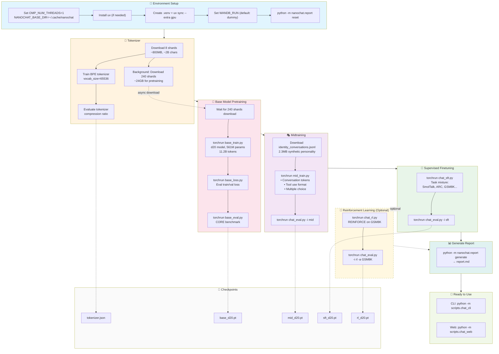
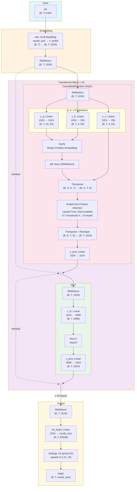

# Speedrun

```mermaid
flowchart TD
    subgraph ENV["🔧 Environment Setup"]
        E1["Set OMP_NUM_THREADS=1<br/>NANOCHAT_BASE_DIR=~/.cache/nanochat"]
        E2["Install uv (if needed)"]
        E3["Create .venv + uv sync --extra gpu"]
        E4["Set WANDB_RUN (default: dummy)"]
        E5["python -m nanochat.report reset"]
        E1 --> E2 --> E3 --> E4 --> E5
    end

    subgraph TOK["📝 Tokenizer"]
        T1["Download 8 shards<br/>~800MB, ~2B chars"]
        T2["Background: Download 240 shards<br/>~24GB for pretraining"]
        T3["Train BPE tokenizer<br/>vocab_size=65536"]
        T4["Evaluate tokenizer<br/>compression ratio"]
        T1 --> T2
        T1 --> T3 --> T4
    end

    subgraph BASE["🧠 Base Model Pretraining"]
        B0["Wait for 240 shards download"]
        B1["torchrun base_train.py<br/>d20 model, 561M params<br/>11.2B tokens"]
        B2["torchrun base_loss.py<br/>Eval train/val loss"]
        B3["torchrun base_eval.py<br/>CORE benchmark"]
        B0 --> B1 --> B2 --> B3
    end

    subgraph MID["🎭 Midtraining"]
        M1["Download identity_conversations.jsonl<br/>2.3MB synthetic personality"]
        M2["torchrun mid_train.py<br/>• Conversation tokens<br/>• Tool use format<br/>• Multiple choice"]
        M3["torchrun chat_eval.py -i mid"]
        M1 --> M2 --> M3
    end

    subgraph SFT["🎯 Supervised Finetuning"]
        S1["torchrun chat_sft.py<br/>Task mixture:<br/>SmolTalk, ARC, GSM8K..."]
        S2["torchrun chat_eval.py -i sft"]
        S1 --> S2
    end

    subgraph RL["🎲 Reinforcement Learning (Optional)"]
        R1["torchrun chat_rl.py<br/>REINFORCE on GSM8K"]
        R2["torchrun chat_eval.py<br/>-i rl -a GSM8K"]
        R1 --> R2
    end

    subgraph REPORT["📊 Generate Report"]
        REP["python -m nanochat.report generate<br/>→ report.md"]
    end

    subgraph USE["🚀 Ready to Use"]
        U1["CLI: python -m scripts.chat_cli"]
        U2["Web: python -m scripts.chat_web"]
    end

    ENV --> TOK
    TOK --> BASE
    T2 -.->|"async download"| B0
    BASE --> MID
    MID --> SFT
    SFT -.->|"optional"| RL
    SFT --> REPORT
    RL -.-> REPORT
    REPORT --> USE

    subgraph CHECKPOINTS["💾 Checkpoints"]
        direction LR
        C1["tokenizer.json"]
        C2["base_d20.pt"]
        C3["mid_d20.pt"]
        C4["sft_d20.pt"]
        C5["rl_d20.pt"]
    end

    T4 -.-> C1
    B3 -.-> C2
    M3 -.-> C3
    S2 -.-> C4
    R2 -.-> C5

    style ENV fill:#e1f5fe
    style TOK fill:#fff3e0
    style BASE fill:#fce4ec
    style MID fill:#f3e5f5
    style SFT fill:#e8f5e9
    style RL fill:#fff8e1,stroke-dasharray: 5 5
    style REPORT fill:#e0f2f1
    style USE fill:#f1f8e9
    style CHECKPOINTS fill:#fafafa
```

---

# GPT Code

```mermaid
flowchart TB
    subgraph Input
        idx["idx<br/>(B, T) int64"]
    end

    subgraph Embedding
        wte["wte: nn.Embedding<br/>vocab_size → n_embd<br/>(B, T) → (B, T, 1024)"]
        norm1["RMSNorm<br/>(B, T, 1024)"]
    end

    subgraph Block["Transformer Block × 20"]
        direction TB
        
        subgraph Attention["CausalSelfAttention (GQA)"]
            norm_attn["RMSNorm<br/>(B, T, 1024)"]
            
            subgraph QKV["Q, K, V Projections"]
                c_q["c_q: Linear<br/>1024 → 1024<br/>(B, T, 16, 64)"]
                c_k["c_k: Linear<br/>1024 → 256<br/>(B, T, 4, 64)"]
                c_v["c_v: Linear<br/>1024 → 256<br/>(B, T, 4, 64)"]
            end
            
            rope["RoPE<br/>Rotary Position Embedding"]
            qk_norm["QK Norm (RMSNorm)"]
            transpose1["Transpose<br/>(B, H, D, T) → (B, H, T, D)"]
            sdpa["Scaled Dot-Product Attention<br/>causal=True, GQA enabled<br/>K,V broadcast 4→16 heads"]
            transpose2["Transpose + Reshape<br/>(B, H, T, D) → (B, T, 1024)"]
            c_proj_attn["c_proj: Linear<br/>1024 → 1024"]
        end
        
        add1(("+"))
        
        subgraph MLP["MLP"]
            norm_mlp["RMSNorm<br/>(B, T, 1024)"]
            c_fc["c_fc: Linear<br/>1024 → 4096<br/>(B, T, 4096)"]
            relu2["ReLU²<br/>relu(x)²"]
            c_proj_mlp["c_proj: Linear<br/>4096 → 1024<br/>(B, T, 1024)"]
        end
        
        add2(("+"))
    end

    subgraph Output
        norm_final["RMSNorm<br/>(B, T, 1024)"]
        lm_head["lm_head: Linear<br/>1024 → vocab_size<br/>(B, T, 65536)"]
        softcap["Softcap: 15·tanh(x/15)<br/>squash to [-15, 15]"]
        logits["logits<br/>(B, T, vocab_size)"]
    end

    idx --> wte --> norm1
    norm1 --> norm_attn
    
    norm_attn --> c_q & c_k & c_v
    c_q & c_k --> rope
    rope --> qk_norm
    qk_norm --> transpose1
    c_v --> transpose1
    transpose1 --> sdpa --> transpose2 --> c_proj_attn
    
    norm1 -.->|residual| add1
    c_proj_attn --> add1
    
    add1 --> norm_mlp --> c_fc --> relu2 --> c_proj_mlp
    add1 -.->|residual| add2
    c_proj_mlp --> add2
    
    add2 -->|"× 20 layers"| norm_final
    norm_final --> lm_head --> softcap --> logits

    style Input fill:#e1f5fe
    style Embedding fill:#fff3e0
    style Block fill:#f3e5f5
    style Attention fill:#fce4ec
    style MLP fill:#e8f5e9
    style Output fill:#fff8e1    
```